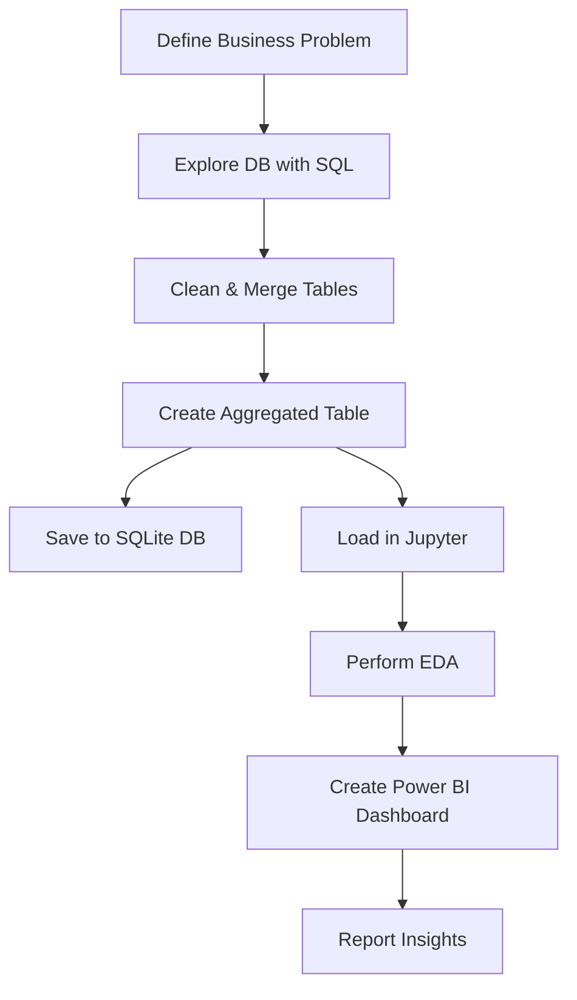

# 📦 Vendor Performance Analysis Project

Effective inventory and sales management is crucial for optimizing profitability in the retail and wholesale sectors. This project aims to help businesses identify inefficiencies in pricing, vendor performance, and inventory turnover to enhance decision-making and overall profitability.

---

## Business Problem

Companies often face losses due to poor inventory practices, inefficient pricing strategies, and vendor over-dependence. This analysis aims to:

- Identify underperforming brands needing promotional or pricing adjustments.
- Determine top vendors contributing to sales and gross profit.
- Analyze the effect of bulk purchasing on unit cost.
- Assess inventory turnover to improve efficiency and reduce holding costs.
- Investigate profitability variance between high- and low-performing vendors


## Project Workflow


1. **Define Business Problem**
2. **Data Collection & Preparation using SQL**
3. **Exploratory Data Analysis (EDA) in Python**
4. **Dashboard Creation in Power BI**
5. **Report Writing and Business Insights**


## Tools & Technologies

| Tool        | Purpose                         |
|-------------|----------------------------------|
| **Python**  | Data analysis & scripting        |
| **Pandas**  | Data manipulation                |
| **SQL**     | Data extraction from SQLite      |
| **Power BI**| Dashboard creation               |
| **Jupyter** | EDA & visualization              |
| **Matplotlib/Seaborn** | Visual analytics     |

---

## Data Aggregation using SQL (Final Query)

The query below creates the final `vendor_sales_summary` by joining purchase, sales, and freight data using Common Table Expressions (CTEs):

```python
vendor_sales_summary = pd.read_sql_query("""
WITH FreightSummary AS (
    SELECT
        VendorNumber, 
        SUM(Freight) AS FreightCost 
    FROM vendor_invoice
    GROUP BY VendorNumber
), 
PurchaseSummary AS (
    SELECT
        p.VendorNumber,
        p.VendorName,
        p.Brand, 
        p.Description, 
        p.PurchasePrice, 
        pp.Volume, 
        pp.Price AS ActualPrice,
        SUM(p.Quantity) AS TotalPurchaseQuantity,
        SUM(p.Dollars) AS TotalPurchaseDollars
    FROM purchases p
    JOIN purchase_prices pp
        ON p.Brand = pp.Brand
    WHERE p.PurchasePrice > 0
    GROUP BY 
        p.VendorNumber, p.VendorName, p.Brand, p.Description, p.PurchasePrice, pp.Price, pp.Volume
),
SalesSummary AS (
    SELECT 
        VendorNo, 
        Brand, 
        SUM(SalesDollars) AS TotalSalesDollars,
        SUM(SalesPrice) AS TotalSalesPrice,
        SUM(SalesQuantity) AS TotalSalesQuantity,
        SUM(ExciseTax) AS TotalExciseTax
    FROM sales
    GROUP BY VendorNo, Brand
)
SELECT 
    ps.VendorNumber,
    ps.VendorName, 
    ps.Brand,
    ps.Description, 
    ps.PurchasePrice, 
    ps.ActualPrice,
    ps.Volume, 
    ps.TotalPurchaseQuantity, 
    ps.TotalPurchaseDollars,
    ss.TotalSalesQuantity,
    ss.TotalSalesDollars,
    ss.TotalSalesPrice,
    ss.TotalExciseTax,
    fs.FreightCost
FROM PurchaseSummary ps 
LEFT JOIN SalesSummary ss
    ON ps.VendorNumber = ss.VendorNo
    AND ps.Brand = ss.Brand
LEFT JOIN FreightSummary fs
    ON ps.VendorNumber = fs.VendorNumber
ORDER BY ps.TotalPurchaseDollars DESC
""", conn)

```


## 📂 Folder Structure

```
Vendor_Performance_Analysis/
│
├── data/
│   └── inventory.db                  # SQLite database
│
├── sql/                               # SQL scripts for data cleaning and aggregation
│
├── notebooks/
│   └── Vendor_Performance_Analysis.ipynb  # Main notebook
│
│
├── logs/
│   └── ingestion.log                 # Logs for ETL operations
│
├── scripts/
│   └── ingest_to_db.py              # Save aggregated table to DB
│
├── powerbi/
│   └── dashboard.pbix               # Power BI dashboard file
│
├── report/
│   └── final_report.pdf             # Business summary
│
└── README.md                        # Project documentation
```

---

## Data Pipeline Overview



---


## Sample Python Analysis

```python
import pandas as pd
from sqlalchemy import create_engine
import seaborn as sns
import matplotlib.pyplot as plt

# Connect to SQLite
engine = create_engine('sqlite:///data/inventory.db')
df = pd.read_sql("SELECT * FROM vendor_summary", con=engine)

# Visualize average ratings
sns.histplot(df['avg_rating'], bins=10, kde=True)
plt.title('Average Vendor Rating Distribution')
plt.show()
```

---

## Power BI Dashboard Preview

Below is a preview of the Power BI dashboard showing key vendor KPIs:


> 📁 File: `powerbi/Inventory_Management.pbix`

---

## Report Summary

The final report contains:
- Project Goals
- Analysis Methodology
- Key Insights
- Recommendations

📁 File: `report/final_report.pdf`

---

## Outcomes & Insights

- Identified top and low-performing vendors based on delivery time and rating
- Highlighted cost-effectiveness of certain vendors
- Suggested potential areas for renegotiation and vendor replacement

---

## 📎 Resources

- Full Jupyter Notebook: [`Vendor_Performance_Analysis.ipynb`](notebooks/Vendor_Performance_Analysis.ipynb)

## 🙋‍♂️ Author

**Faisal Khan**  
*Data Analyst | Python | SQL | Power BI*

📧 Contact: *thisside.faisalkhan@example.com*  
🔗 GitHub: [github.com/yourusername](https://github.com/yourusername)
