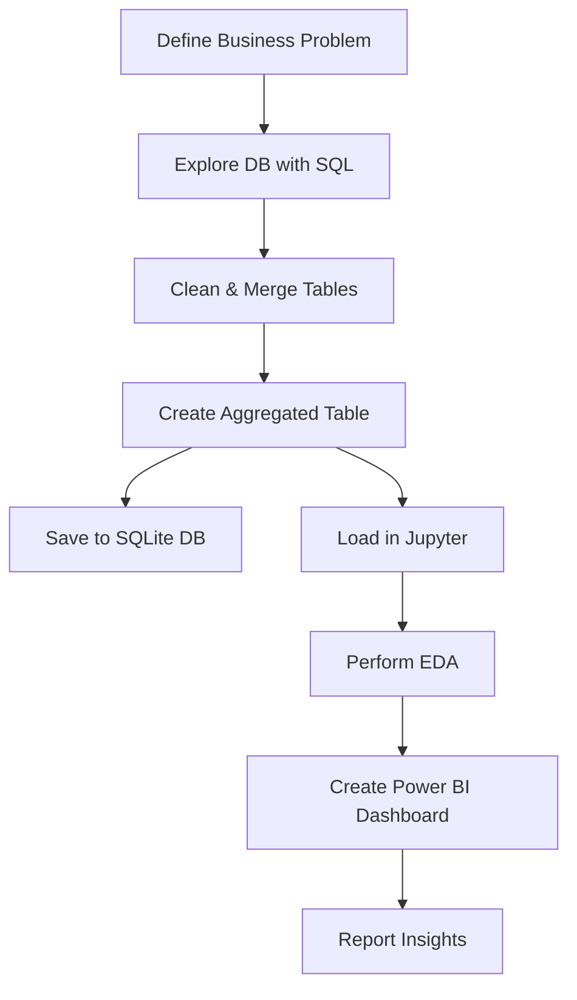

# 📦 Vendor Performance Analysis Project
<p>Effective inventory and sales management is crucial for optimizing profitability in the retail and wholesale sectors.  
This project aims to help businesses identify inefficiencies in pricing, vendor performance, and inventory turnover to enhance decision-making and overall profitability.

Through comprehensive data analysis using Python and SQL on a retail dataset, the project evaluates key metrics such as gross profit, profit margins, stock turnover, freight costs, and sales-to-purchase ratios.  
By identifying top-performing vendors and brands, as well as underperforming products with high margins, the analysis supports strategic decisions related to procurement, pricing, and promotions.

The insights derived also highlight how bulk purchasing can significantly reduce unit costs, contributing to improved profit margins. Additionally, the project reveals the extent of capital locked in unsold inventory and identifies vendors with low stock turnover, enabling businesses to take corrective actions.

All findings are visualized through intuitive plots and dashboards, facilitating easy interpretation for stakeholders and aiding in the formulation of data-driven business strategies.
</p>

---

## Project Workflow


## Business Problem

Companies often face losses due to poor inventory practices, inefficient pricing strategies, and vendor over-dependence. This analysis aims to:

- Identify underperforming brands needing promotional or pricing adjustments.
- Determine top vendors contributing to sales and gross profit.
- Analyze the effect of bulk purchasing on unit cost.
- Assess inventory turnover to improve efficiency and reduce holding costs.
- Investigate profitability variance between high- and low-performing vendors

## Tools & Technologies

| Tool        | Purpose                         |
|-------------|----------------------------------|
| **Python**  | Data analysis & scripting        |
| **Pandas**  | Data manipulation                |
| **SQL**     | Data extraction from SQLite      |
| **Power BI**| Dashboard creation               |
| **Jupyter** | EDA & visualization              |
| **Matplotlib/Seaborn** | Visual analytics     |

---

## Database Connection

To run the analysis, establish a connection to the SQLite database:

```python
from sqlalchemy import create_engine
import pandas as pd
import sqlite3

# Create a SQLAlchemy engine to connect to the SQLite database named 'inventory.db'
engine = create_engine('sqlite:///inventory.db')

# Connect to the SQLite database file
conn = sqlite3.connect('inventory.db')

# Checking tables present in the database
tables = pd.read_sql_query(
    "SELECT name FROM sqlite_master
     WHERE type='table' ORDER BY name ASC", conn
)
tables


```

## Data Aggregation using SQL (Final Query)
The query below creates the final `vendor_sales_summary` by joining purchase, sales, and freight data using Common Table Expressions (CTEs):

```python
vendor_sales_summary = pd.read_sql_query("""
WITH FreightSummary AS (
    SELECT
        VendorNumber, 
        SUM(Freight) AS FreightCost 
    FROM vendor_invoice
    GROUP BY VendorNumber
), 
PurchaseSummary AS (
    SELECT
        p.VendorNumber,
        p.VendorName,
        p.Brand, 
        p.Description, 
        p.PurchasePrice, 
        pp.Volume, 
        pp.Price AS ActualPrice,
        SUM(p.Quantity) AS TotalPurchaseQuantity,
        SUM(p.Dollars) AS TotalPurchaseDollars
    FROM purchases p
    JOIN purchase_prices pp
        ON p.Brand = pp.Brand
    WHERE p.PurchasePrice > 0
    GROUP BY 
        p.VendorNumber, p.VendorName, p.Brand, p.Description, p.PurchasePrice, pp.Price, pp.Volume
),
SalesSummary AS (
    SELECT 
        VendorNo, 
        Brand, 
        SUM(SalesDollars) AS TotalSalesDollars,
        SUM(SalesPrice) AS TotalSalesPrice,
        SUM(SalesQuantity) AS TotalSalesQuantity,
        SUM(ExciseTax) AS TotalExciseTax
    FROM sales
    GROUP BY VendorNo, Brand
)
SELECT 
    ps.VendorNumber,
    ps.VendorName, 
    ps.Brand,
    ps.Description, 
    ps.PurchasePrice, 
    ps.ActualPrice,
    ps.Volume, 
    ps.TotalPurchaseQuantity, 
    ps.TotalPurchaseDollars,
    ss.TotalSalesQuantity,
    ss.TotalSalesDollars,
    ss.TotalSalesPrice,
    ss.TotalExciseTax,
    fs.FreightCost
FROM PurchaseSummary ps 
LEFT JOIN SalesSummary ss
    ON ps.VendorNumber = ss.VendorNo
    AND ps.Brand = ss.Brand
LEFT JOIN FreightSummary fs
    ON ps.VendorNumber = fs.VendorNumber
ORDER BY ps.TotalPurchaseDollars DESC
""", conn)

```


## 📂 Folder Structure

```
Vendor_Performance_Analysis/
│
├── data/
│   └── inventory.db                  # SQLite database
│
├── sql/                               # SQL scripts for data cleaning and aggregation
│
├── notebooks/
│   └── Vendor_Performance_Analysis.ipynb  # Main notebook
│
│
├── logs/
│   └── ingestion.log                 # Logs for ETL operations
│
├── scripts/
│   └── ingest_to_db.py              # Save aggregated table to DB
│
├── powerbi/
│   └── dashboard.pbix               # Power BI dashboard file
│
├── report/
│   └── final_report.pdf             # Business summary
│
└── README.md                        # Project documentation
```

---


## Data Pipeline Overview



---

## Power BI Dashboard Preview

Below is a preview of the Power BI dashboard showing key vendor KPIs:


> 📁 File: [`Inventory_Management.pbix`](https://app.powerbi.com/view?r=eyJrIjoiNTA4MzAyYjctNTY4NC00YzNlLWEzMGUtMDc4ZTdkNDhkOWVjIiwidCI6IjQyYjUxMzUzLTZhMzctNDA5Zi1hMmZlLTc3OGE5YmUzMTllNCJ9)

---

## Key Outcomes

- 📌 **Cleaned & Valid Dataset**  
  - Removed inconsistencies like negative profit margins, gross profit and zero sales.
  - Final dataset contains **8,565 valid records** ready for analysis.

- 📌 **Top Vendors & Brands Identified**  
  - **Top Vendors by Sales**:
    - DIAGEO NORTH AMERICA INC – `$67.99M`
    - MARTIGNETTI COMPANIES – `$39.33M`
    - PERNOD RICARD USA – `$32.06M`
  - **Top Brands by Sales**:
    - Jack Daniels No 7 Black – `$7.96M`
    - Tito’s Handmade Vodka – `$7.40M`
    - Grey Goose Vodka – `$7.21M`
 

- 📌 **Underperforming High-Margin Brands**  
  - Brands like *Santa Rita Organic* and *Debauchery Pnt Nr* had **high margins but low sales**.
  - Recommend strategic promotions or pricing updates.

- 📌 **Vendor Purchase Contribution**  
  - **Top 10 vendors contribute 65.69%** of total purchases.
  - Demonstrated using Pareto and Donut charts.


- 📌 **Bulk Purchasing Reduces Unit Price**  
  - Small Orders: `$39.06` per unit  
  - Large Orders: `$10.78` per unit  
  - Bulk purchases reduce cost by **~72%**, boosting profitability.

- 📌 **Inventory Issues Detected**  
  - Vendors like *ALISA CARR BEVERAGES* have **very low stock turnover (<1)**.
  - Total capital locked in unsold inventory: **`$2.71M`**

- 📌 **Profit Margin Confidence Intervals**  
  - **Top-performing vendors**: Mean Margin `31.17%`, CI: `(30.74%, 31.61%)`  
  - **Low-performing vendors**: Mean Margin `41.55%`, CI: `(40.48%, 42.62%)`  
  - Indicates low performers rely on **premium pricing**, not volume.


---

## Business Insights

- **Sales & Purchase Alignment**  
  - Nearly perfect correlation (0.999) between purchase and sales quantity → **Efficient inventory turnover**

- ⚠️ **Freight Cost Variability**  
  - Wide cost range suggests **logistical inefficiencies** or bulk shipment variability.

- ⚠️ **Stock Turnover ≠ Profitability**  
  - High turnover doesn’t always translate to higher profit → Possible discounting or low-margin sales.

- ⚠️ **Skewed Distributions Detected**  
  - `GrossProfit`, `ProfitMargin`, `StockTurnover`, and `SalesToPurchaseRatio` had extreme outliers.  
  - Addressed via filtering, capping, and visual diagnostics.

- 🔁 **Consistent Data Handling**  
  - Applied statistical thresholds and visualizations to ensure clean, actionable data for analysis and reporting.
 
---

## Resources

- Full Jupyter Notebook: [`Vendor_Performance_Analysis.ipynb`](Final_Workbook.ipynb)

---

## Report Summary

The final report contains:
- Project Goals
- Analysis Methodology
- Key Insights
- Recommendations

📁 File: `report/final_report.pdf`

---

## Author

**Faisal Khan**  
*Data Analyst | Python | SQL | Power BI | Machine learnig*

📧 Contact: *thisside.faisalkhan@example.com*  
🔗 GitHub: [github.com/yourusername](https://github.com/Faisal-khann)
