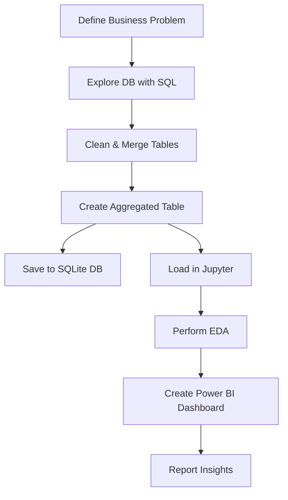

# 📦 Vendor Performance Analysis - Inventory Management

<em>Analyzing vendor efficiency and profitability to support strategic purchasing and inventory decisions using **SQL**, **Python**, and **Power BI**.</em>

---

## 📌 Table of Contents
- [Overview](#Overview)
- [Project Workflow](#Project-Workflow)
- [Business Problem](#business-problem)
- [Dataset](#dataset)
- [Tools & Technologies](#tools--technologies)
- [Project Structure](#📂Project-Structure)
- [Data Pipeline Overview](#Data-Pipeline-Overview)
- [Key Outcomes](#Key-Outcomes)
- [Business Insights](#Business-Insights)
- [Dashboard Preview](#Dashboard-Preview)
- [How to Run This Project](#How-to-Run-This-Project)
- [Author & Contact](#Author-&-Contact)

---
## Overview
<p> This project evaluates vendor performance and retail inventory dynamics to drive strategic insights for purchasing, pricing, and inventory optimization. A complete data pipeline was built using SQL for ETL, Python for analysis and hypothesis testing, and Power BI for visualization.
    
Through comprehensive data analysis using Python and SQL on a retail dataset, the project evaluates key metrics such as gross profit, profit margins, stock turnover, freight costs, and sales-to-purchase ratios.  
By identifying top-performing vendors and brands, as well as underperforming products with high margins, the analysis supports strategic decisions related to procurement, pricing, and promotions.

The insights derived also highlight how bulk purchasing can significantly reduce unit costs, contributing to improved profit margins. Additionally, the project reveals the extent of capital locked in unsold inventory and identifies vendors with low stock turnover, enabling businesses to take corrective actions.
</p>

---

## Project Workflow


## Business Problem

Companies often face losses due to poor inventory practices, inefficient pricing strategies, and vendor over-dependence. This analysis aims to:

- Identify underperforming brands needing promotional or pricing adjustments.
- Determine top vendors contributing to sales and gross profit.
- Analyze the cost-benefit of bulk purchasing.
- Assess inventory turnover to improve efficiency and reduce holding costs.
- Investigate profitability variance between high- and low-performing vendors

## Tools & Technologies

| Tool        | Purpose                         |
|-------------|----------------------------------|
| **Python**  | Data analysis & scripting        |
| **Pandas**  | Data manipulation                |
| **SQL**     | Data extraction from SQLite      |
| **Power BI**| Dashboard creation               |
| **Jupyter** | EDA & visualization              |
| **Matplotlib/Seaborn** | Visual analytics     |

---
## Dataset
- Multiple CSV files located in /data/ folder (sales, vendors, inventory)
- Summary table created from ingested data and used for analysis
---

## 📂 Project Structure

```
vendor-performance-analysis/
│
├── README.md
├── .gitignore
├── requirements.txt
├── Vendor Performance Report.pdf
│
├── notebooks/                  # Jupyter notebooks
│   ├── ingesting-logs.ipynb
    ├── sql-powered_data_analysis.ipynb
│   ├── vendor_performance_analysis.ipynb
│
├── scripts/                    # Python scripts for ingestion and processing
│   ├── ingestion_db.py
│   └── get_vendor_summary.py
│
├── dashboard/                  # Power BI dashboard file
│   └── vendor_performance_dashboard.pbix
```

---


## Data Pipeline Overview



---

## Key Outcomes

- 📌 **Cleaned & Valid Dataset**  
  - Removed inconsistencies like negative profit margins, gross profit and zero sales.
  - Final dataset contains **8,565 valid records** ready for analysis.

- 📌 **Top Vendors & Brands Identified**  
  - **Top Vendors by Sales**:
    - DIAGEO NORTH AMERICA INC – `$67.99M`
    - MARTIGNETTI COMPANIES – `$39.33M`
    - PERNOD RICARD USA – `$32.06M`
  - **Top Brands by Sales**:
    - Jack Daniels No 7 Black – `$7.96M`
    - Tito’s Handmade Vodka – `$7.40M`
    - Grey Goose Vodka – `$7.21M`
 

- 📌 **Underperforming High-Margin Brands**  
  - Brands like *Santa Rita Organic* and *Debauchery Pnt Nr* had **high margins but low sales**.
  - Recommend strategic promotions or pricing updates.

- 📌 **Vendor Purchase Contribution**  
  - **Top 10 vendors contribute 65.69%** of total purchases.
  - Demonstrated using Pareto and Donut charts.


- 📌 **Bulk Purchasing Reduces Unit Price**  
  - Small Orders: `$39.06` per unit  
  - Large Orders: `$10.78` per unit  
  - Bulk purchases reduce cost by **~72%**, boosting profitability.

- 📌 **Inventory Issues Detected**  
  - Vendors like *ALISA CARR BEVERAGES* have **very low stock turnover (<1)**.
  - Total capital locked in unsold inventory: **`$2.71M`**

- 📌 **Profit Margin Confidence Intervals**  
  - **Top-performing vendors**: Mean Margin `31.17%`, CI: `(30.74%, 31.61%)`  
  - **Low-performing vendors**: Mean Margin `41.55%`, CI: `(40.48%, 42.62%)`  
  - Indicates low performers rely on **premium pricing**, not volume.


---

## Business Insights

- **Sales & Purchase Alignment**  
  - Nearly perfect correlation (0.999) between purchase and sales quantity → **Efficient inventory turnover**

- ⚠️ **Freight Cost Variability**  
  - Wide cost range suggests **logistical inefficiencies** or bulk shipment variability.

- ⚠️ **Stock Turnover ≠ Profitability**  
  - High turnover doesn’t always translate to higher profit → Possible discounting or low-margin sales.

- ⚠️ **Skewed Distributions Detected**  
  - `GrossProfit`, `ProfitMargin`, `StockTurnover`, and `SalesToPurchaseRatio` had extreme outliers.  
  - Addressed via filtering, capping, and visual diagnostics.

- **Consistent Data Handling**  
  - Applied statistical thresholds and visualizations to ensure clean, actionable data for analysis and reporting.
 
---
## Dashboard Preview

`Below is a preview of the Power BI dashboard showing key vendor KPIs:`
> 📁 File: [`Inventory_Management.pbix`](https://app.powerbi.com/view?r=eyJrIjoiNTA4MzAyYjctNTY4NC00YzNlLWEzMGUtMDc4ZTdkNDhkOWVjIiwidCI6IjQyYjUxMzUzLTZhMzctNDA5Zi1hMmZlLTc3OGE5YmUzMTllNCJ9)
<div>
    
    
</div>

---
## How to Run This Project
 
 1. Clone the repository:
    
         git clone https://github.com/yourusername/vendor-performance-analysis.git

 2. Load the CSVs and ingest into database:

        python scripts/ingestion_db.py

 3. Create vendor summary table:

        python scripts/get_vendor_summary.py
    
4. Open and Run Notebooks
   
    ○ `notebooks/exploratory_data_analysis.ipynb`  
    ○ `notebooks/vendor_performance_analysis.ipynb`
    
 6. Open Power BI Dashboard:

        Dashboard/Inventory_Management.pbix

---

## Author & Contact

**Faisal Khan**  
*Data Analyst*

For any questions, collaboration opportunities, or project-related inquiries, feel free to reach out:

- 📧 [Email](mailto:thisside.faisalkhan@example.com)  
- 💼 [LinkedIn](http://www.linkedin.com/in/faisal-khan-332b882bb)

Let’s connect and build something impactful!

---
> Made with ❤️ using Jupyter Notebook & Power BI
